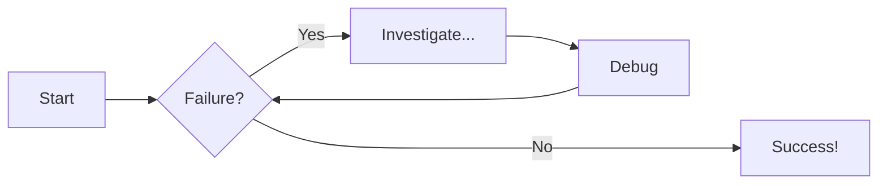
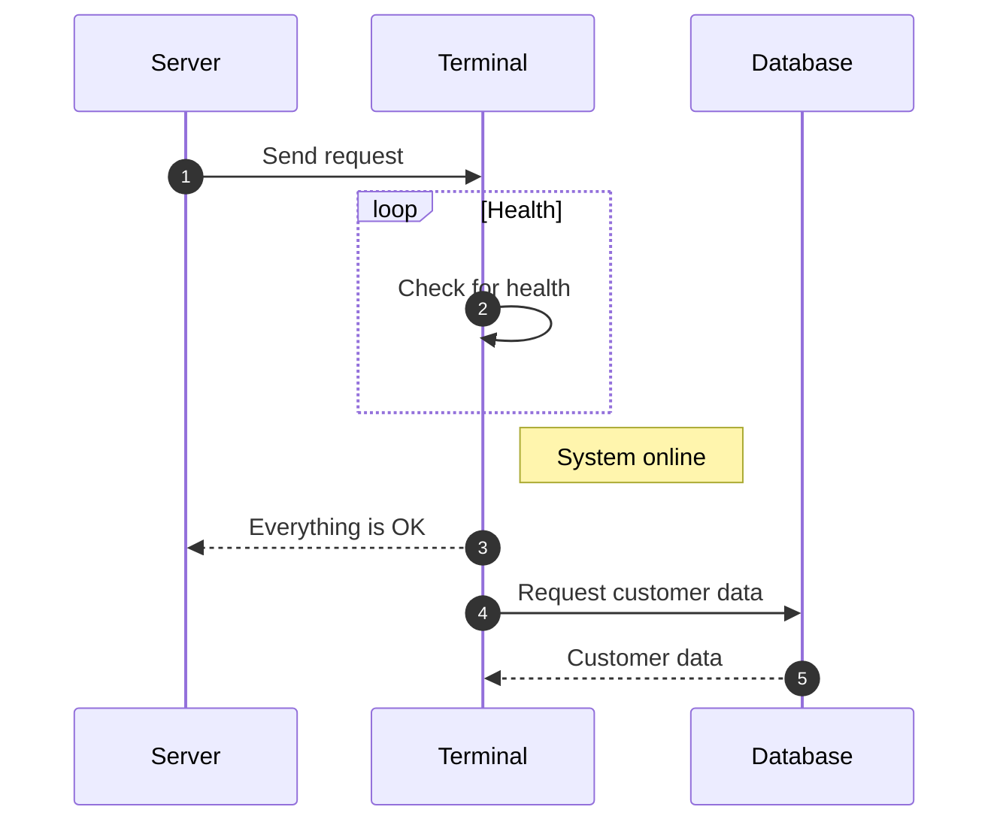

# Common commands in material for mkdocs

For full documentation visit [mkdocs.org](https://www.mkdocs.org).

## Commands

* `mkdocs new [dir-name]` - Create a new project.
* `mkdocs serve` - Start the live-reloading docs server.
* `mkdocs build` - Build the documentation site.
* `mkdocs -h` - Print help message and exit.

## Project layout

```py title="code-examples.md" linenums="1" hl_lines="2-3 5"
class Foo(boo):
    __init__(self):
        number = 5

    pass
``` 


## Generic Content

=== "Plain text"

    Some plain text

=== "A List"

    1. one
    2. two
    3. three

=== "Some code"

```html title="html"
    <div>
        <table> 
        </table>
    </div>
```

## Admonitions or callouts

!!! note

    === "1"

        C'era una volta un giovane baldassare.

    === "2"

        ```py
        class Test():
            pass
        ```


??? info "Quali sono i tipi supportati?"

    `note`, `abstract`, `info`, `tip`, `success`, `question`, `warning`, 
    `failure`, `danger`, `bug`, `example`, `quote`

???+ note inline end ""

    mettere il `+` apre già le gambe

con `inline` mettiamo a lato sinistro, con `inline end` a lato destro.

## Flowcharts



## Sequence Diagrams



[Download the PDF](../assets/files/myfile.pdf)